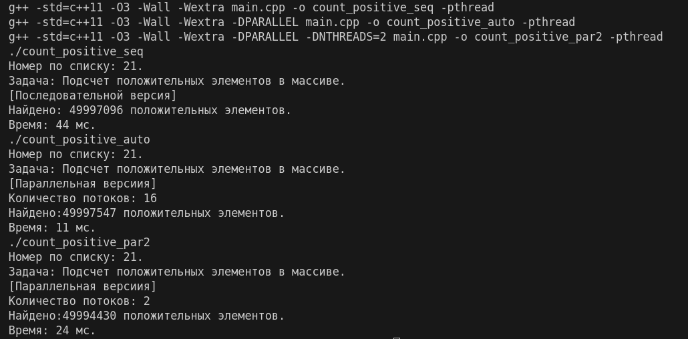

# Задание по многопоточному программированию в общей памяти с использованием C++ 11 и выше

**Выполнил: студент 134 группы Дорофеев А. В.**

## Общая постановка задачи

Варианты задачи:  
1) Найти максимум в массиве  
2) Найти количество положительных элементов в массиве  
3) Найти сумму массива (да, это было на лекциях, но реализуйте в коде)  
4) Найти первое число, превышающее предварительно заданное

Вы должны написать программу, которая делает одно из написанного выше. Чтобы определить, что, возьмите остаток от деления вашего номера на 4 и прибавьте 1. 

Варианты параллелизации:  
1) реализовать при помощи априорного разделения, использовать packaged_task  
2) реализовать при помощи atomic (общий счетчик)  
3) реализовать при помощи mutex (без condition_variable), возвращать из потоков значение через future/promise  
4) реализовать при помощи mutex + condition_variable  
5) реализовать при помощи parallel stl

Вы должны использовать один из методов параллелизации выше. Чтобы определить, возьмите целое частное от деления вашего номера на 4, затем остаток от деления на 5 и прибавьте 1.

Варианты чисел в массиве:  
1) int (32-bit)  
2) float  
3) long int / long long int (64-bit)  
4) double

Чтобы определить ваш вариант, возьмите целое частное от деления вашего номера на 20 и прибавьте 1

Подробности по оформлению на слайдах.

## Конкретная постановка задачи

- Мой номер по списку: 21.
- Вариант задачи: $(21 \mod 4) + 1 = 1 + 1 = 2 \Rightarrow$ *"Найти количество положительных элементов в массиве"*.
- Вариант параллелизации: $(( 21 \quad div\quad 4) \mod 5) + 1 = (5 \mod 5) + 1 = 0 + 1 = 1 \Rightarrow$ *"Реализовать при помощи априорного разделения, использовать packaged_task"*.
- Варианты чисел в массиве: $(21 \quad div \quad 20) + 1=1+1=2 \Rightarrow$ "float".

## Описание решения

> **Априорное разделение** — это паттерн параллелизации, при котором массив заранее (априори) делится на равные части, и каждая часть обрабатывается отдельным потоком. 

**Принцип работы:**
1. Массив размером `N` делится на `T` равных частей (где `T` — количество потоков);
2. Каждый поток обрабатывает свою часть независимо: `[i * N/T, (i+1) * N/T)]`;
3. После завершения всех потоков результаты суммируются.

> `std::packaged_task` — это класс-обертка для вызываемого объекта (функции, лямбды), который:
> - Связывает выполнение функции с объектом `std::future`
> - Позволяет запустить функцию в отдельном потоке
> - Обеспечивает получение результата через `future.get()` 

Программе можно как указать конкретное количество потоков, так и не указать, тогда она автоматически определит количество доступных потоков:
- Функция `std::thread::hardware_concurrency()` возвращает количество потоков, поддерживаемых процессором;
- Если определить количество не удалось, то используется значение равное `2`. Его можно переопределить через макрос `-DNTHREADS=N` при компиляции.

**Структура программы**
1. Массив (`1000000000` элементов) заполняется случайными числами в диапазоне `[-10.0, 10.0]`.
2. **Параллельная обработка** (при наличии флага `-DPARALLEL`):
   - Определение количества потоков (автоматически или явно указывется);
   - Создание потоков;
   - Каждому потоку назначается блок массива;
   - Использование `packaged_task` для связывания функции и результата;
   - Запуск потоков и ожидание завершения;
   - Суммирование результатов из всех `future`;
3. **Последовательная обработка** (без флага `-DPARALLEL`): выполняется обработка всего массива в одном потоке.

## Сборка и запуск


```sh
make
``` 

Для сборки присутствует `Makefile`.
Можно посмотреть какие различные варианты компиляции описаны в нём, по умолчанию `make` или `make all` выполнит вариант `run_all`, который скомпилирует три варианта исходного кода:
- последовательное решение;
- параллельное (автоматическое определение потоков);
- параллельное (2 потока).

## Пример работы программы


