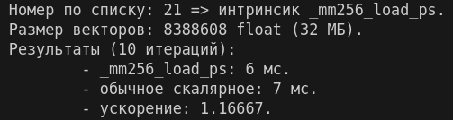

# Задание по интринсикам

**Выполнил: студент 134 группы Дорофеев А. В.**
## Общая постановка задачи

1. Возьмите остаток деления своего номера на 2. Если 0, то берете в начале _mm, иначе _mm256.
2. Возьмите остаток деления своего номера на 4. Если 0 или 2, то берете в конце _pd, иначе _ps.
3. Возьмите частное от деления своего номера на 8 без остатка. В зависимости от значения выберите середину инструкции: 
	- 0 или 9: `_add`
	- 1 или 10: `_and`
	- 2 или 11: `_load`
	- 3: `_store`
	- 4:` _set` или `_set1`
	- 5: `_cmp` или `_cmpge`
	- 6: `_mul`
	- 7: `_div`
	- 8: `_sub`

- Реализуйте простейшую программу, демонстрирующую полезность именно этой конструкции.  
- Результат сдается здесь - нужен код программы (должна компилироваться) и описание, что вы этим демонстрируете (можно внутри кода в комментариях, но тогда на английском). 
- Рекомендуется прикладывать Makefile.
## Конкретная постановка задачи

Мой номер по списку: 21.
1. $21 \mod 2 = 1 \Rightarrow$ `_mm256`.
2. $21 \mod 4= 1 \Rightarrow$ `_ps`.
3. $21 \quad div \quad 8 = 2\Rightarrow$ `_load`.
- `_mm256_load_ps`
## Описание решения

> `_mm256_load_ps` — это AVX интринсик, который загружает 8 значений типа float (32-бита каждое) из выровненной памяти в 256-битный регистр `__m256`.

```cpp
__m256 _mm256_load_ps(float const * mem_addr);
```
- `mem_addr` — указатель на выровненную память.
- Возвращает вектор `__m256`, содержащий 8 float значений.

Программа сравнивает производительность векторного сложения с использованием AVX 
и обычного скалярного:
1. **AVX**:
   - Обрабатывает 8 элементов за одну операцию;
   - Использует SIMD параллелизм.
2. **Скалярное**: 
   - цикл с последовательной обработкой - обрабатывает по одному элементу за раз.
## Сборка и запуск

```sh
make
``` 

Для сборки присутствует `Makefile`.
- `all/run` - сборка и запуск.
- `clean` - отчистка скомпилированных фалов.


## Пример работы программы


