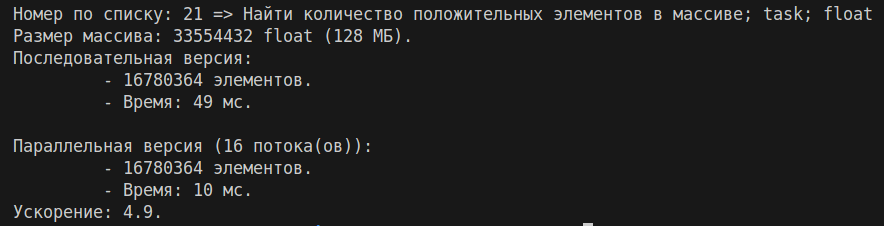

# Задание по OpenMP

**Выполнил: студент 134 группы Дорофеев А. В.**
## Общая постановка задачи

- Вы должны написать программу, которая делает одно из написанного выше. Чтобы определить, что, возьмите остаток от деления вашего номера на 4 и прибавьте 1: 
	1. Найти максимум в массиве.
	2. Найти количество положительных элементов в массиве.
	3. Найти сумму массива.
	4. Найти первое число, превышающее заранее заданное.
$$(number \mod 4) + 1.$$

- Выберите один из методов параллельной реализации: 
	1. Использование `task` для динамического распределения работы.
	2. Использование `parallel sections`, где разные секции выполняют разные части работы.
	3. Использование `parallel for` и `reduction`.
	4. Использование `atomic` для аккумулирования результата.
	5. Использование `critical` для защиты общей переменной.
	Чтобы определить ваш вариант, возьмите целое частное от деления номера на 4, затем остаток от деления на 5 и прибавьте 1: $$((number \quad div \quad 4) \mod 5)+ 1.$$

- Варианты чисел в массиве: 
	1. `int (32-bit)`
	2. `float`
	3. `long int / long long int (64-bit)`
	4. `double`
	Чтобы определить ваш вариант, возьмите целое частное от деления вашего номера на 20 и прибавьте 1: $$(number \quad div \quad 20) + 1.$$

- Программа должна быть консольной и работать на любой системе, без специфичных IDE.
- Должны быть инструкции по сборке программы (например, Makefile).
- Минимум — команда сборки; желательно — полноценная организация проекта.
- Программа должна выводить ваш номер и какую задачу вы решали.
- Makefile или CMake.
- Поддержка флага, чтобы можно было включать или отключать параллельную версию, а также указывать количество потоков.
- Подача программы единым архивом или через репозиторий.
- Комментарии к коду, поясняющие реализацию.
## Конкретная постановка задачи

Мой номер по списку: `21`.
1. $(21 \mod 4) + 1 = 1 + 1  = 2 \Rightarrow$ *Найти количество положительных элементов в массиве.*
2. $((21 \quad div \quad 4) \mod 5) + 1 = (5 \mod 5) + 1 = 0 + 1 = 1 \Rightarrow$ *Использование `task` для динамического распределения работы.*
3. $(21 \quad div \quad 20) + 1 = 1 + 1 = 2\Rightarrow$ `float`.
## Описание решения

1. Массив размером $32 \cdot 10^6$ элементов заполняется случайными `float` числами в диапазоне от $-1.0$ до $1.0$.
2. **Последовательная версия:** простой цикл для подсчета положительных элементов.
3. **Параллельный версия (task):**
   - Массив разбивается на блоки размером $10^6$ элементов каждый.
   - Для каждого блока создается отдельная задача: `#pragma omp task`.
   - Каждая задача подсчитывает положительные элементы в своем блоке локально.
   - Локальные счетчики объединяются через атомарную операцию: `#pragma omp atomic`.
   - После создания всех задач программа ждет их завершения: `#pragma omp taskwait`.
## Сборка и запуск

```sh
make
``` 

Для сборки присутствует `Makefile`.
- `all/run` - сборка и запуск.
- `run_serial` - запуск без параллелизма.
- `run_parallel_2/run_parallel_4/run_parallel_8/run_parallel_16` - запуск параллельной версии с разным количеством потоков: 2, 4, 8, 16 (по умолчанию `make` запускает на 4 потоках).
- `clean` - отчистка скомпилированных фалов.

Ручной запуск:

```sh
./main --threads N    # Запуск с N потоками
./main --serial       # Запуск без параллелизма
```

## Пример работы программы


