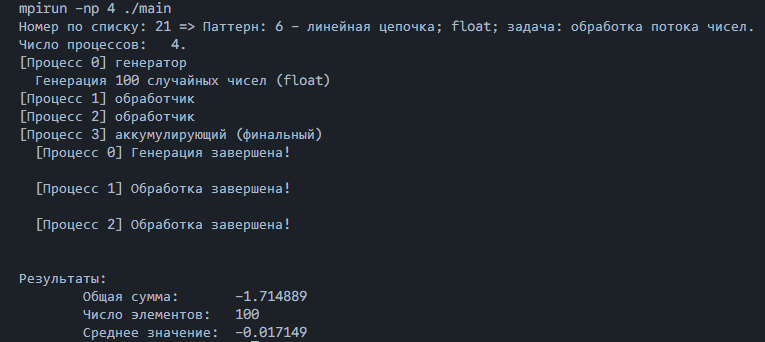

# Задание по MPI

**Выполнил: студент 134 группы Дорофеев А. В.**
## Общая постановка задачи

Каждому студенту назначается MPI-паттерн (способ организации параллельных вычислений).
Необходимо:
- Выбрать или придумать задачу, для которой этот паттерн уместен.
- Реализовать простейшую программу на MPI, демонстрирующую пользу этого паттерна.
- Минимизировать использование других возможностей MPI (чтобы акцент был именно на выбранном паттерне).


**Как определить ваш паттерн?**
Пусть $number$ — ваш номер в списке группы.
Вычислите:
	Число pattern от 1 до 10 и определяет ваш MPI-паттерн
$$pattern = ((number \quad div \quad 4) \mod 10)+ 1.$$
1. **SPMD + статическое разбиение данных** 
	Каждый процесс обрабатывает свой “кусок” данных, разбиение определяется по рангу. Возможны простые коллективные операции (`Bcast`, `Reduce` и т.п.).
2. **Master–worker (динамическая раздача работы)**
	Один процесс (обычно ранг 0) раздаёт задания другим и собирает результаты через `MPI_Send / MPI_Recv`.
3. **Группы процессов и подкоммуникаторы**
	Разделение `MPI_COMM_WORLD` на подгруппы с помощью `MPI_Comm_split / MPI_Group_*`.
4. **Producer–consumer на сообщениях**
	Один или несколько процессов производят задания, другие потребляют; очередью задач.
5. **Кольцевой обмен (ring)**
	Процессы образуют цикл, данные (токен, частичный результат и т.п.) передаются по кругу: `rank → (rank+1) % size`.
6. **Линейная цепочка / конвейер (pipeline)**
	Процессы образуют цепочку, данные проходят от процесса 0 к последнему, по пути последовательно обрабатываются.
7. **Коллективные операции как основной механизм**
	Активное использование MPI_Bcast, MPI_Scatter, MPI_Gather, MPI_Allreduce и др. вместо ручных циклов с Send/Recv.
8. **Пользовательские типы данных `(MPI_Type_*)`** 
	Определение и использование MPI-типа для пересылки нетривиальной структуры данных: подматрицы, структур, “редких” элементов массива.
9. **Упаковка и распаковка (`MPI_Pack/Unpack`)**
	Передача нескольких разнотипных фрагментов данных одним сообщением с явной упаковкой в буфер.
10. **Особые режимы посылки (`MPI_Bsend/Rsend`)**
	Использование буферизованной или “готовой” посылки вместо базового `MPI_Send`, демонстрация их особенностей.


**Задачу можно выбрать самостоятельно, но она должна быть разумной** Возможные варианты:
- обработка одномерного массива (сумма, максимум, скалярное произведение и т.п.);
- численное интегрирование на отрезке;
- операции с матрицами (умножение на вектор, суммирование по строкам/столбцам); 
- работа со структурированными данными (массив структур, точки в 2D/3D, сетка); 
- своя прикладная задача (имитация очередей, модель, вычислительный эксперимент и т.п.). 
В отчёте/комментариях объясните, почему ваш паттерн подходит именно для выбранной задачи.

**Варианты чисел в массиве**: 
	1. `int (32-bit)`
	2. `float`
	3. `long int / long long int (64-bit)`
	4. `double`
	Чтобы определить ваш вариант, возьмите остаток от деления на 4 и прибавьте 1:$$(number \mod 4) + 1.$$

- Программа должна быть консольной и работать на любой системе, без специфичных IDE.
- Должны быть инструкции по сборке программы (например, Makefile).
- Минимум — команда сборки; желательно — полноценная организация проекта.
- Программа должна выводить ваш номер и какую задачу вы решали.
- Makefile или CMake.
- Подача программы единым архивом или через репозиторий.
- Комментарии к коду, поясняющие реализацию.
## Конкретная постановка задачи

Мой номер по списку: `21`.
1. $((21 \quad div \quad 4) \mod 10) + 1 = (5 \mod 10) + 1  = 5 + 1 = 6 \Rightarrow$ Линейная цепочка / конвейер (pipeline). Процессы образуют цепочку, данные проходят от процесса 0 к последнему, по пути последовательно обрабатываются.
2. $(21 \mod 4) + 1 = 1 + 1 = 2\Rightarrow$ `float`.
3. Задача: обработка потока чисел через конвейер процессов.
## Описание решения

 1. Процесс №0: генерирует 100 случайных float чисел;
 2. Процесс №1: применяет $f(x) = 2x$;
 3. Процесс №2: применяет $g(x) = sin(x)$;
 4. Процесс №3: получает результат и суммирует все значения;
 5. Вывод результатов.

При числе процессов $>4$ программа по‑прежнему реализует конвейерную схему: процесс 0 генерирует данные, последний процесс аккумулирует результат, а все промежуточные процессы образуют последовательность стадий обработки. Первые две стадии выполняют $f(x)$ и $g(x)$, а все последующие применяют $h(x)=x^2$. Таким образом, при увеличении числа процессов увеличивается длина конвейера и количество шагов обработки, но структура обмена данными и принцип работы остаются неизменными.

Для данной задачи подходит паттерн **линейная цепочка / конвейер (pipeline)**, потому что:
- Данные проходят от 0 процесса к последнему;
- Каждый процесс делает одну операцию;
- Пока процесс 2 обрабатывает данные, процесс 1 уже начинает получать новые данные от процесса 0.

## Сборка и запуск

```sh
make
``` 

Для сборки присутствует `Makefile`.
- `all` - сборка и запуск.
- `run_np2/run_np3/run_np4/run_np8/run_np12` - запуск с разным количеством процессов: 2, 3, 4, 8, 12 (по умолчанию `make` запускает с 4).
- `clean` - отчистка скомпилированных фалов.

Ручной запуск:

```sh
mpirun -np N ./main   # Запуск с N процессами
```

## Пример работы программы


